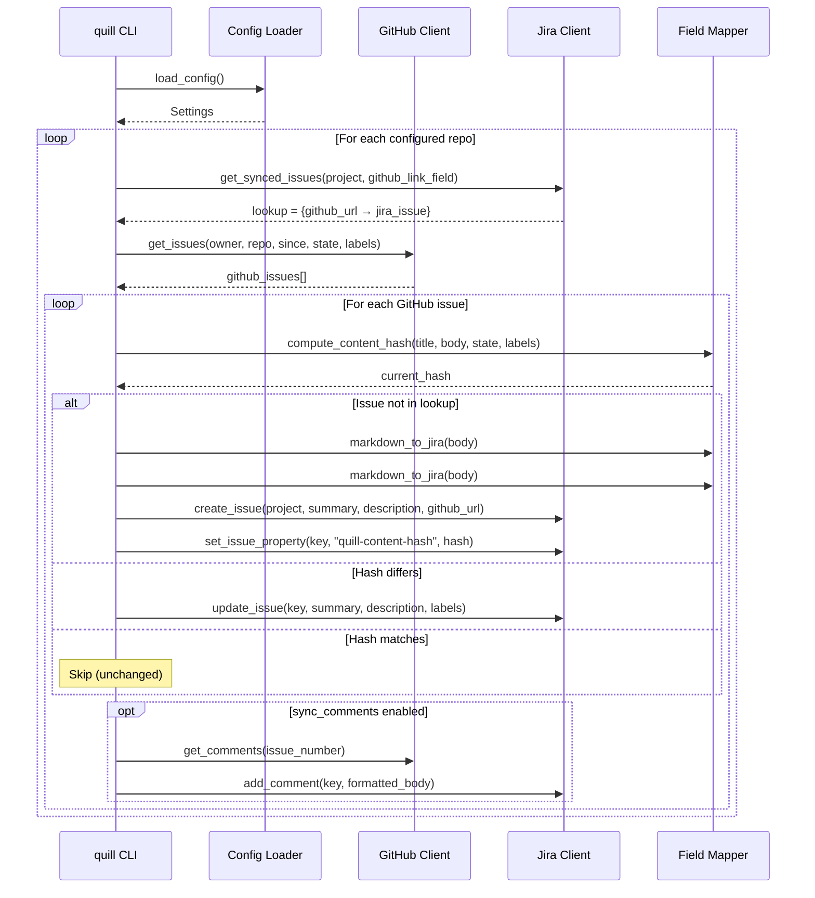

# Architecture

This document describes how `quill` works internally.

---

## Overview

`quill` is a Python CLI tool that syncs GitHub issues to Jira. It is **stateless** — all sync metadata is stored in Jira itself, not in a local file or database.

```
┌──────────────────┐         ┌──────────────────┐
│   GitHub REST    │◄────────│  quill CLI /   │────────►┌──────────────────┐
│   API (public)   │  fetch  │  GitHub Actions  │  upsert │  Jira REST API   │
│                  │ issues  │                  │ issues  │   (on-premise)   │
└──────────────────┘         └──────────────────┘         └──────────────────┘
                                     │
                                     │ reads
                                     ▼
                              ┌──────────────┐
                              │ quill.toml │
                              │   (config)   │
                              └──────────────┘
```

---

## Component Map

```
src/quill/
├── cli.py              ← argparse entry point (sync, check, status, init)
├── config.py           ← Pydantic models + 4-layer configuration loader
├── github_client.py    ← PyGithub wrapper (fetch issues, comments, labels)
├── jira_client.py      ← python-jira wrapper (CRUD, JQL lookups, transitions)
├── mapper.py           ← Markdown→Jira markup, content hashing, hash footer
├── sync.py             ← Core sync engine (orchestrates the full flow)
└── log.py              ← Rich-based logging and token redaction
```

### Data Flow



---

## Stateless Design

### The Problem with State Files

Traditional sync tools keep a local database (e.g., SQLite) mapping `(repo, issue#) → JIRA-KEY`. This causes problems:

- **CI/CD headaches**: GitHub Actions runners are ephemeral. You need `actions/cache`, artifact uploads, or git-committed state files to persist state between runs.
- **Multi-machine conflicts**: If you run the sync from both a laptop and CI, the state files diverge.
- **Maintenance burden**: State files can become corrupted, stale, or lost.

### The Quill Approach

Instead of a local state file, quill stores the GitHub issue URL in a **Jira custom field** and uses **JQL** to discover already-synced issues at runtime.

| Component | Where it lives | Purpose |
|---|---|---|
| GitHub URL mapping | Jira custom field (`github_link_field`) | Links each Jira issue back to its GitHub origin |
| Content hash | Jira Entity Property (`quill-content-hash`) | Fast change detection without full-text diffing |

### Trade-offs

| ✅ Advantage | ⚠️ Trade-off |
|---|---|
| No local state to manage | Requires a Jira custom field (one-time setup) |
| Works natively in CI/CD | JQL lookup adds API calls per sync run |
| Multi-machine safe | Jira admin access needed to create the field |
| State survives reinstalls | Slightly more Jira API usage |

---

## Change Detection

To determine if a GitHub issue has changed, quill computes a SHA256 hash of:

1. **Title**
2. **Body** (raw Markdown)
3. **State** (`open` / `closed`)
4. **Labels** (sorted, comma-joined)

This hash is attached to the Jira issue as an invisible JSON property called `quill-content-hash` via the Jira Entity Properties API.

On the next sync:

- quill extracts the hash from the Jira entity property
- computes a fresh hash from the current GitHub issue
- if they differ → update the Jira issue
- if they match → skip

---

## Comment Sync

Comments are synced one-way: GitHub → Jira. Each comment includes:

- **Attribution**: The GitHub username and a link back to the comment
- **Content**: The comment body converted from Markdown to Jira wiki markup

To avoid posting duplicate comments, quill checks if the GitHub comment's `html_url` already appears in any existing Jira comment body.

---

## Error Handling

- **Per-issue errors**: If a single issue fails to sync, the error is logged and quill continues to the next issue. A summary of errors is printed at the end.
- **API connectivity**: The `quill check` command tests both GitHub and Jira connectivity before you attempt a sync.
- **Rate limits**: GitHub PATs provide 5,000 requests/hour. For large repositories, consider setting the `since` filter to limit the backfill window.
