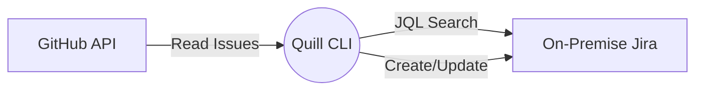

# Quill Documentation

Welcome to the `quill` documentation. `quill` is a stateless GitHub-to-Jira issue synchronization tool.

## Key Features

- **Fully Stateless:** Runs perfectly in GitHub actions without needing a local database.
- **Incremental Updates:** Uses SHA256 hashes to detect changes without full-text diffing.
- **Multi-Repository:** Map many public GitHub repos to a single on-premise Jira instance.

## How it works

## Where to go next?

-   :material-rocket-launch: **Quickstart**

    ---

    Get up and running with Quill in less than 5 minutes.

    [:octicons-arrow-right-24: Go to Quickstart](quickstart.md)

-   :material-cog: **Configuration**

    ---

    Learn how to map your GitHub repositories to Jira projects.

    [:octicons-arrow-right-24: Read Configuration](configuration.md)

-   :material-console: **CLI Reference**

    ---

    Discover all available commands, flags, and options.

    [:octicons-arrow-right-24: View CLI](cli-reference.md)

-   :material-sitemap: **Architecture**

    ---

    Understand the stateless design and how Quill queries Jira.

    [:octicons-arrow-right-24: Read Architecture](architecture.md)

